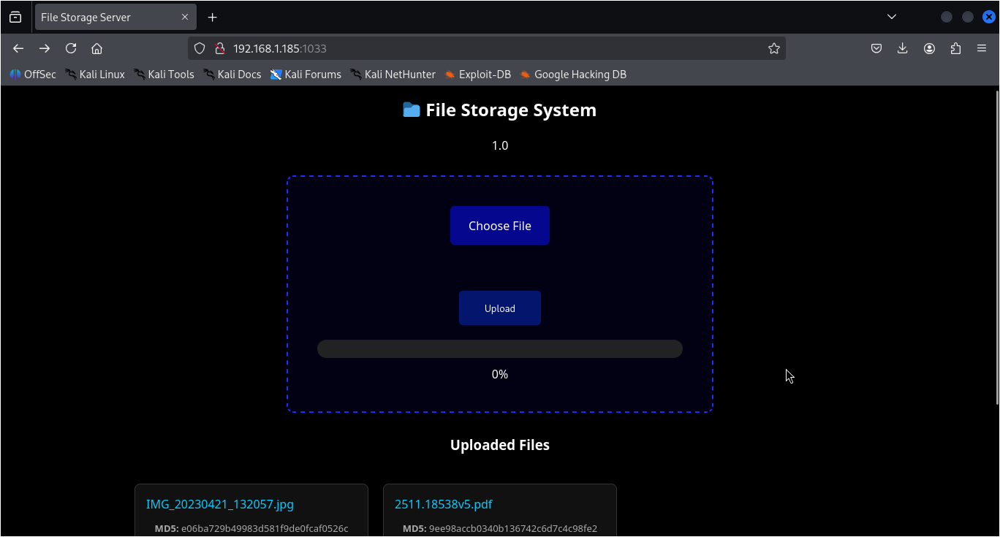
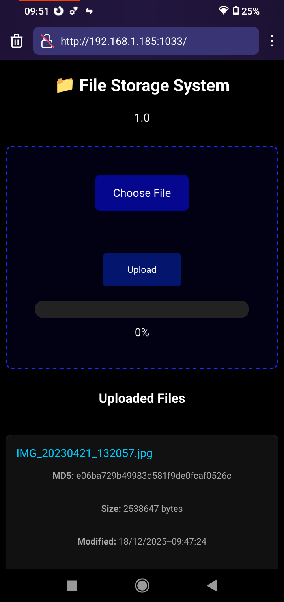

# Raspberry Pi File Storage Server (NAS-like)

This project allows you to use your Raspberry Pi device as a NAS (Network Attached Storage).
This project allows you to upload, download, and manage files from **any device on the same local network** (PC, phone, tablet) using a modern web interface.

---

## Features

- Upload files from any device on the same network
- Download stored files via browser
- Delete uploaded files
- File metadata display (size, last modified time)
- Responsive UI (mobile, tablet, desktop)
- Chunk-based upload (handles large files efficiently)
---

## Minimum Requirements

- **Raspberry Pi 3** or newer  
- Python 3.8+
- Flask
- Local network (Wi-Fi or Ethernet)

---

### Desktop View

### Mobile View

---

## 🏗️ How It Works (Backend Logic)
When the server starts, it broadcasts via the IP address of the computer's WLAN0 network interface and port 1033. When you type http://192.168.x.x:1033, you will reach the upload screen. A "files_storage" folder is created in the server's startup area, and files from each device are stored there. When files are received from the other side, they are uploaded in parts, and the parts are combined at the end. This method prevents the process from being interrupted when sending large files.

---

## Usage

1. Deploy the application on a Raspberry Pi
2. Connect the Raspberry Pi to your local network
3. Access the web interface from:
   - A phone
   - A laptop
   - Any device on the same network
4. Upload and manage files easily through the browser

This makes the Raspberry Pi behave like a simple **local NAS (Network Attached Storage)** solution.

---

## Security Notes

- This project is intended for **local network usage**
- No authentication is enabled by default
  
---

## License

This project is open-source and available under the **MIT License**.

---

## Contributions

Contributions, issues, and feature requests are welcome.  
Feel free to fork the project and improve it :)
If you have questions or suggestions, feel free to open an issue or contact the repository owner.

---
